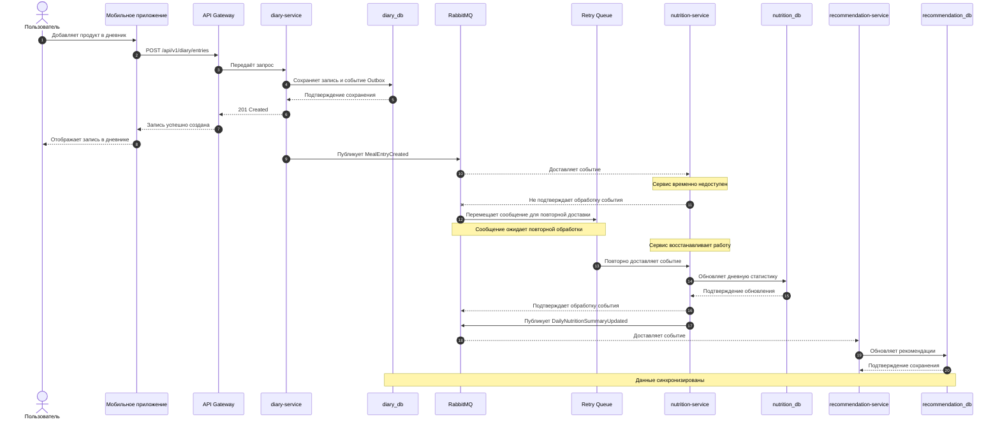

# Диаграмма последовательности: сбой при обновлении дневной статистики

```mermaid
sequenceDiagram
    autonumber
    actor User as Пользователь
    participant Client as Мобильное приложение
    participant Gateway as API Gateway
    participant Diary as diary-service
    participant DiaryDB as diary_db
    participant MQ as RabbitMQ
    participant Retry as Retry Queue
    participant Nutrition as nutrition-service
    participant NutritionDB as nutrition_db
    participant Recommendation as recommendation-service
    participant RecommendationDB as recommendation_db

    User->>Client: Добавляет продукт в дневник
    Client->>Gateway: POST /api/v1/diary/entries
    Gateway->>Diary: Передаёт запрос

    Diary->>DiaryDB: Сохраняет запись и событие Outbox
    DiaryDB-->>Diary: Подтверждение сохранения

    Diary-->>Gateway: 201 Created
    Gateway-->>Client: Запись успешно создана
    Client-->>User: Отображает запись в дневнике

    Diary->>MQ: Публикует MealEntryCreated
    MQ-->>Nutrition: Доставляет событие

    Note over Nutrition: Сервис временно недоступен

    Nutrition--xMQ: Не подтверждает обработку события
    MQ->>Retry: Перемещает сообщение для повторной доставки
    Note over MQ,Retry: Сообщение ожидает повторной обработки

    Note over Nutrition: Сервис восстанавливает работу

    Retry->>Nutrition: Повторно доставляет событие
    Nutrition->>NutritionDB: Обновляет дневную статистику
    NutritionDB-->>Nutrition: Подтверждение обновления
    Nutrition-->>MQ: Подтверждает обработку события

    Nutrition->>MQ: Публикует DailyNutritionSummaryUpdated
    MQ-->>Recommendation: Доставляет событие

    Recommendation->>RecommendationDB: Обновляет рекомендации
    RecommendationDB-->>Recommendation: Подтверждение сохранения

    Note over DiaryDB,RecommendationDB: Данные синхронизированы
```
