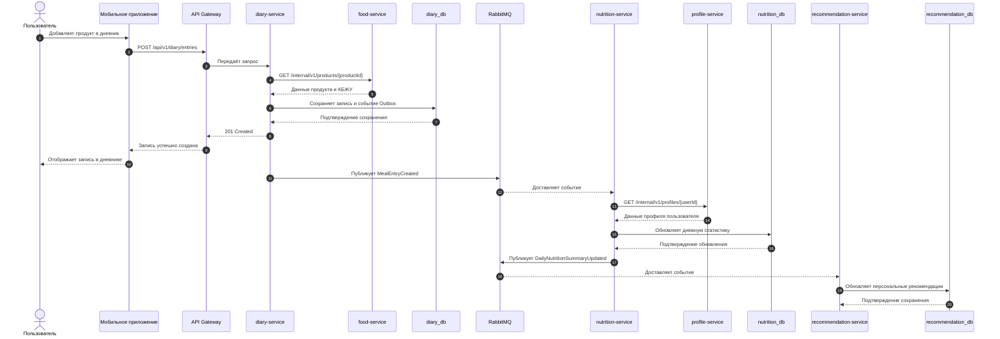

# Диаграмма последовательности: успешное создание записи в дневнике питания

```mermaid
sequenceDiagram
    autonumber
    actor User as Пользователь
    participant Client as Мобильное приложение
    participant Gateway as API Gateway
    participant Diary as diary-service
    participant Food as food-service
    participant DiaryDB as diary_db
    participant MQ as RabbitMQ
    participant Nutrition as nutrition-service
    participant Profile as profile-service
    participant NutritionDB as nutrition_db
    participant Recommendation as recommendation-service
    participant RecommendationDB as recommendation_db

    User->>Client: Добавляет продукт в дневник
    Client->>Gateway: POST /api/v1/diary/entries
    Gateway->>Diary: Передаёт запрос

    Diary->>Food: GET /internal/v1/products/{productId}
    Food-->>Diary: Данные продукта и КБЖУ

    Diary->>DiaryDB: Сохраняет запись и событие Outbox
    DiaryDB-->>Diary: Подтверждение сохранения

    Diary-->>Gateway: 201 Created
    Gateway-->>Client: Запись успешно создана
    Client-->>User: Отображает запись в дневнике

    Diary->>MQ: Публикует MealEntryCreated
    MQ-->>Nutrition: Доставляет событие

    Nutrition->>Profile: GET /internal/v1/profiles/{userId}
    Profile-->>Nutrition: Данные профиля пользователя

    Nutrition->>NutritionDB: Обновляет дневную статистику
    NutritionDB-->>Nutrition: Подтверждение обновления

    Nutrition->>MQ: Публикует DailyNutritionSummaryUpdated
    MQ-->>Recommendation: Доставляет событие

    Recommendation->>RecommendationDB: Обновляет персональные рекомендации
    RecommendationDB-->>Recommendation: Подтверждение сохранения
```
